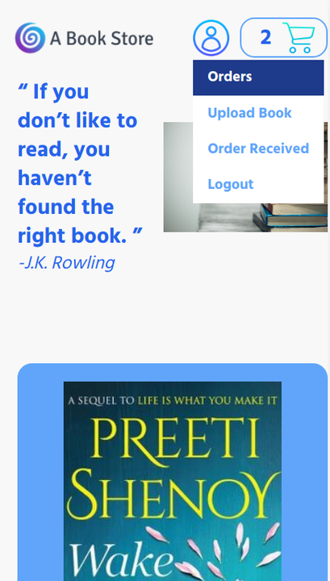
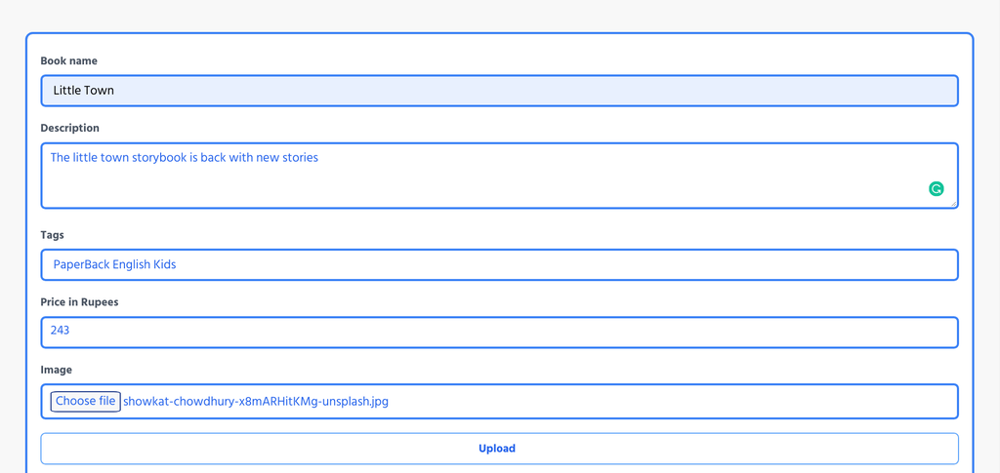
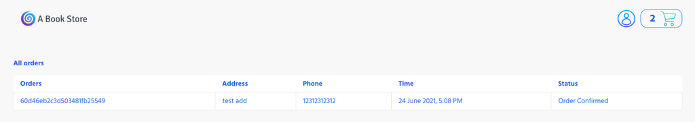
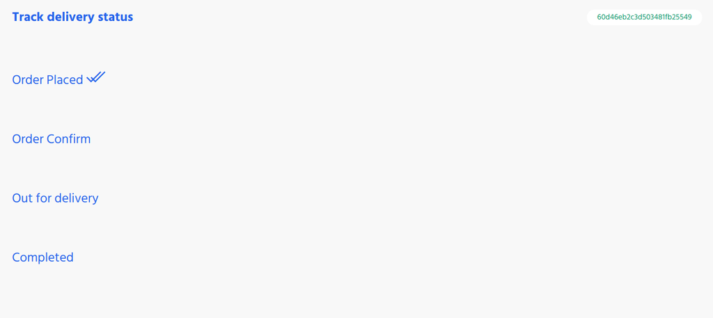

# A book store ✨

### A book store is a bookselling website on which sellers can upload details about a book and can keep track of new orders while a user can order a book.

## Demo
[a-book-store](http://13.233.144.251:3000/)

## Tech 
- Express
- MongoDB

 
## Installation
```sh
npm install
   or
yarn add
Setup .env file
COOKIE_SECERET = put-your-key
MONGO_CONNECTION_URL = mongodb://localhost/
For development environments
npm run dev
npm run watch // for sass
    or
yarn dev
yarn watch // for sass
Sass compilation for production
npm run production
    or
yarn production
```

## Features
### Home page in mobile view

 
#### On this website, you can register as a customer or as a seller. The seller can upload book details.

#### Whenever a customer orders a book order details are shown on the orders received page.

#### Order status can be updated by the seller on the order update page.

#### Customers can check order status on the customer order page


